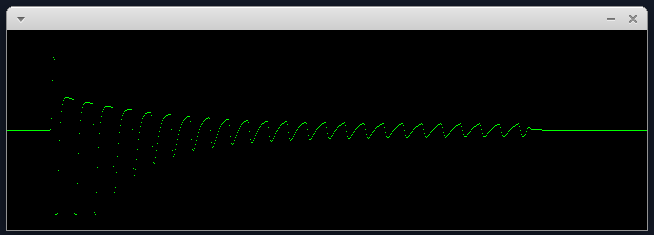

# jscope
JACK, SDL2 and FFT experiments for kinds of audio scope like tools

## Requirements
sudo apt install libsdl2-dev libjack-jackd2-dev libfftw3-dev

## Test
```
make && ./jscope2.exe
```
Connect "jscope" Jack input to some Jack audio output to see something like below.


- Space to freeze display
- Left/Right to change decimation (similar to time zoom)
- Escape to quit

# Ideas
create jpitch, that would display detected pitch ? (maybe with inspiration from Tartini ?)
